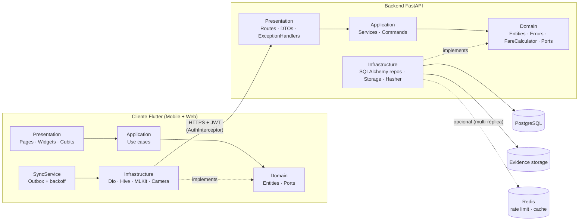
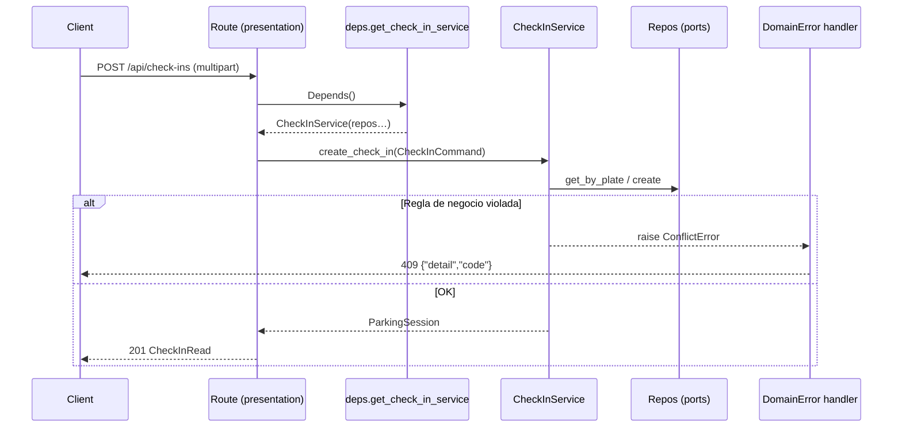
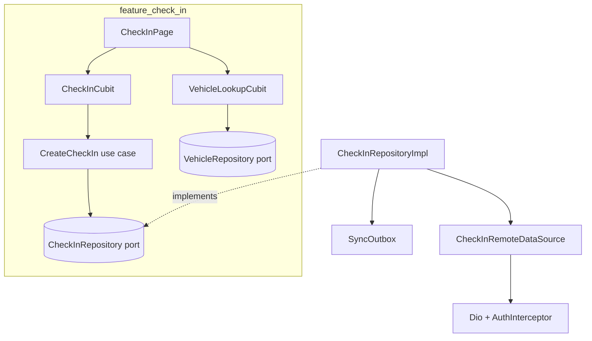
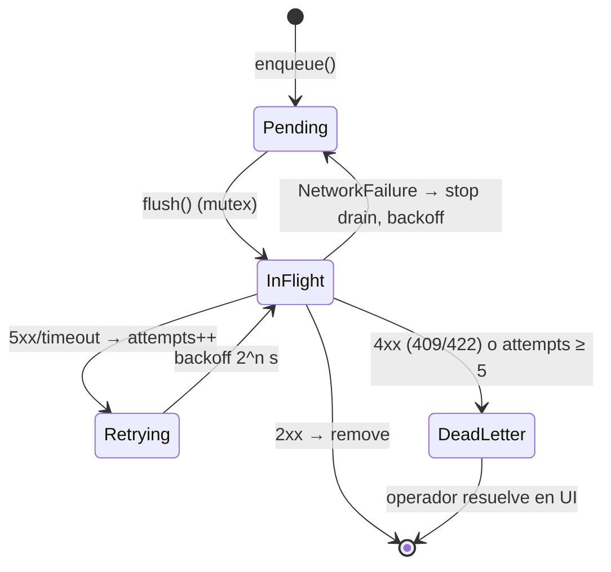
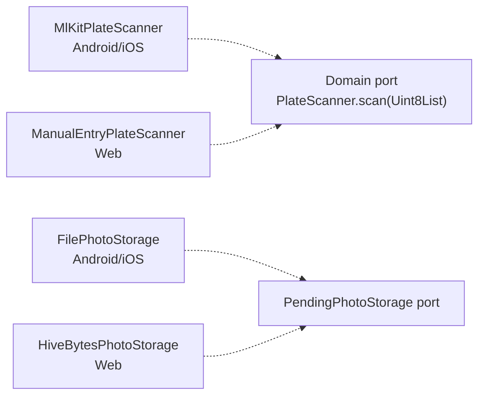
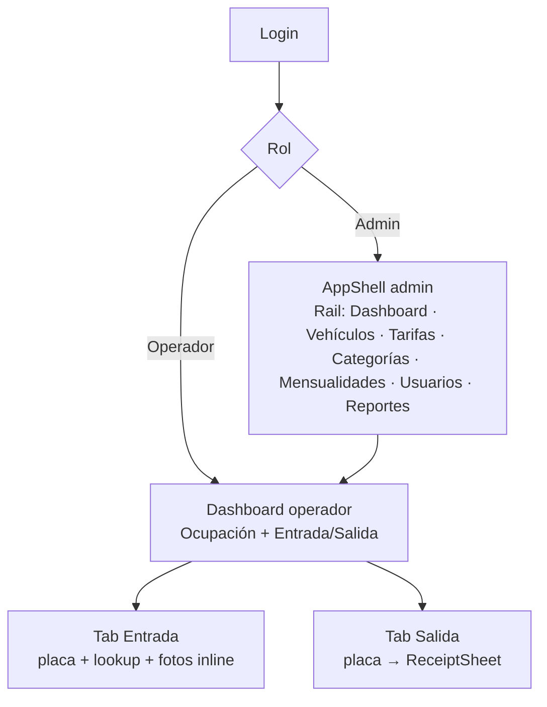
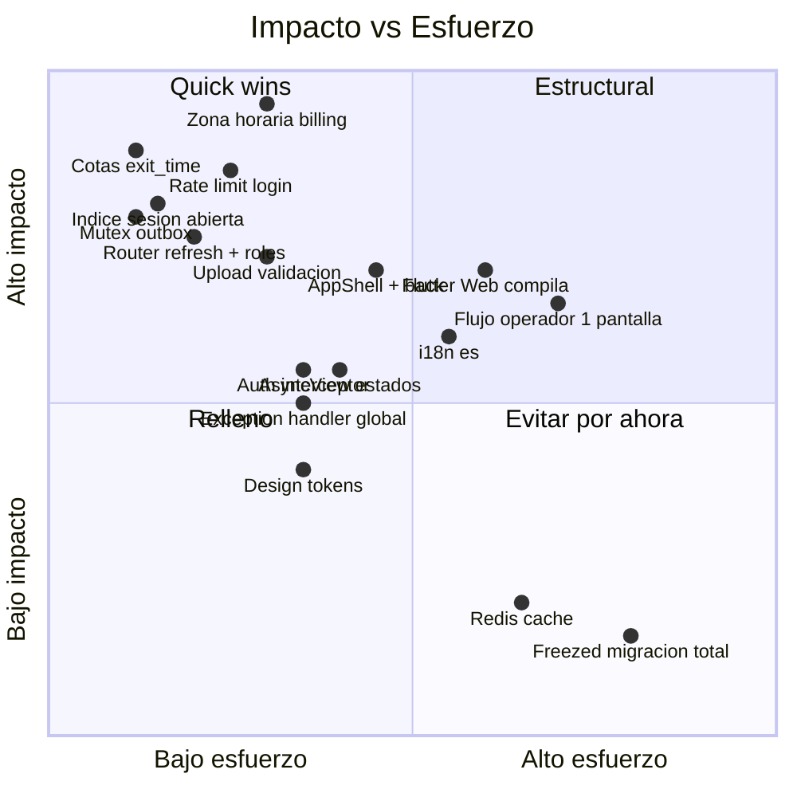
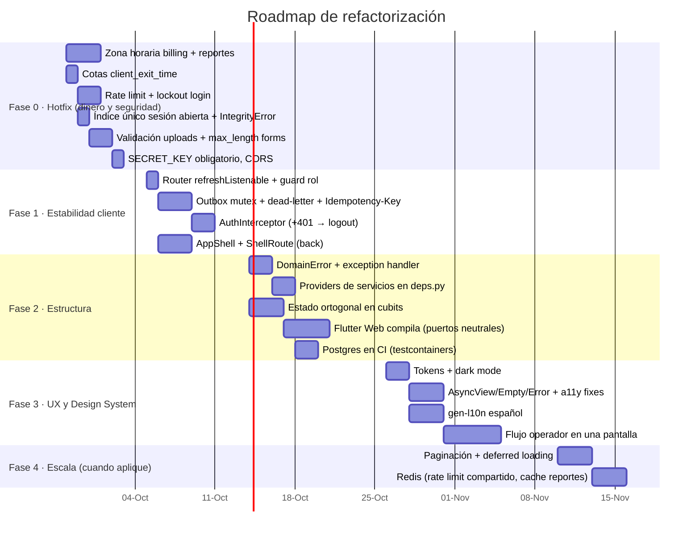

# Plan de Arquitectura y Refactorización — Parking Management

> **Alcance:** Backend FastAPI (`backend/`) · App Flutter móvil (Android/iOS) · App Flutter Web (`web/`, mismo código base).
> **Fecha de auditoría:** 2026-09-25 · **Método:** auditoría estática de solo lectura sobre el código real (referencias `archivo:línea`), ejecución de suites (`uv run pytest`, `flutter test`, `flutter analyze`).
> **Estado base:** Backend 102/103 tests ✅ (1 fallo dependiente del reloj, ver §1.5) · Flutter 146/146 ✅ · `flutter analyze` sin issues.

---

## Resumen ejecutivo

El proyecto **no es un monolito espagueti**: ya sigue Clean Architecture en ambos lados (dominio sin dependencias de framework, unit-of-work por request, repositorios, cubits `sealed` + Equatable, outbox offline). La refactorización es **de endurecimiento, no de reescritura**.

Los riesgos reales, ordenados por impacto de negocio:

| # | Riesgo | Área | Impacto |
|---|--------|------|---------|
| 1 | Cobro y tarifa nocturna calculados en **UTC**, no en hora de Colombia | Backend · billing | 💰 Cobros incorrectos en producción |
| 2 | `client_exit_time` sin cotas → operador puede cobrar ~$0 | Backend · check-out | 💰 Fraude |
| 3 | Login PIN 4–6 dígitos **sin rate limit** | Backend · auth | 🔐 Fuerza bruta trivial |
| 4 | Outbox `flush()` concurrente sin mutex + sin manejo de mensajes venenosos | Flutter · sync | 🧾 Check-ins duplicados / cola bloqueada |
| 5 | Race condition en sesión abierta (check-then-insert sin constraint) | Backend · check-in | 🧾 Doble sesión por vehículo |
| 6 | Logout deja spinner infinito; rutas admin sin guard de rol | Flutter · router | 🔐/UX |
| 7 | **Flutter Web no compila** en producción (`dart:io`, ML Kit, `Image.file`) | Flutter · web | 🌐 Web inutilizable |
| 8 | Navegación con `context.go` → sin back, Android cierra la app | Flutter · UX | UX crítica |

> ℹ️ **Nota sobre "App Web":** no existe una app JS/TS separada. La web es el target Flutter Web. El Capítulo 3 aplica a Flutter Web (ejemplos en Dart). Si en el futuro se construye un panel admin en TS/React, ver Anexo A.

---

## Vista de arquitectura objetivo



---

## 1. Refactorización y Clean Architecture — Backend (Python)

### 1.1 Estado actual de capas

✅ **Bien:** `app/domain` no importa `fastapi` ni `sqlalchemy`. UoW en `database.py:23-30` (commit/rollback único; repos solo `flush`). `expire_on_commit=False`. `response_model` en todas las rutas.

❌ **Violaciones y smells:**

| Hallazgo | Evidencia | Acción |
|---|---|---|
| Rutas acopladas a infraestructura concreta | `routes/check_ins.py:15-26` importa `SqlAlchemy*Repository` | Rutas dependen solo de **servicios** vía providers |
| Servicios instanciados en handlers (26×) | `grep "Service(" routes/` | Providers en `deps.py` |
| Application depende de settings globales | `auth_service.py:3`, `user_service.py:3` | Puertos `PasswordHasherPort`, `TokenIssuerPort` |
| Lógica pura en application | `FareCalculator` en `billing_service.py` | Mover a `domain/billing.py` |
| Dependencia opcional que no debería serlo | `check_in_service.py:48` `categories: ... \| None = None` | Obligatoria + provider único |
| Errores duplicados / código muerto | Dos `VehicleNotFoundError` (`check_in_service.py:17`, `vehicle_service.py:13`); `CheckInCreate` sin uso (`schemas.py:127`) | `domain/errors.py` único; eliminar |

**Estructura objetivo:**

```
backend/app/
├── domain/
│   ├── entities/          # Vehicle, ParkingSession, Tariff…
│   ├── billing.py         # FareCalculator (puro, tz-aware)
│   ├── errors.py          # DomainError jerárquico
│   └── ports.py           # Repos, EvidenceStorage, PasswordHasher, Clock
├── application/
│   ├── commands.py        # CheckInCommand, CheckOutCommand (dataclasses)
│   └── services/          # CheckInService, CheckOutService…
├── infrastructure/
│   ├── db/                # models, repositories, uow
│   ├── storage/           # LocalEvidenceStorage (validación MIME)
│   └── security/          # Argon2Hasher (thread pool), JwtIssuer
└── presentation/
    ├── deps.py            # providers → servicios
    ├── errors.py          # exception handlers
    ├── schemas/           # DTOs Pydantic por feature
    └── routes/
```

### 1.2 Patrones: Repository, Service Layer, DTOs, DI



**Antes** — `routes/check_ins.py` (50 líneas, 11 parámetros, 4 bloques `except → HTTPException`):

```python
@router.post("/check-ins", response_model=CheckInRead, status_code=201)
async def create_check_in(
    plate: str = Form(...),
    photos: list[UploadFile] = File(default=[]),
    category_id: int | None = Form(None),
    color: str | None = Form(None),
    brand: str | None = Form(None),
    current_user: User = Depends(get_current_user),
    vehicles: SqlAlchemyVehicleRepository = Depends(get_vehicle_repository),
    sessions: SqlAlchemyParkingSessionRepository = Depends(get_parking_session_repository),
    photo_repository: SqlAlchemyEvidencePhotoRepository = Depends(get_evidence_photo_repository),
    categories: SqlAlchemyCategoryRepository = Depends(get_category_repository),
    storage: EvidenceStoragePort = Depends(get_evidence_storage),
) -> CheckInRead:
    photo_paths = []
    for upload in photos:
        content = await upload.read()          # sin límite de tamaño
        photo_paths.append(await storage.save(upload.filename or "photo", content))
    service = CheckInService(vehicles, sessions, photo_repository, categories)
    try:
        session = await service.create_check_in(...)
    except VehicleNotRegisteredError as exc:
        raise HTTPException(422, "Vehicle not registered: category_id is required") from exc
    except CategoryNotFoundError as exc:
        raise HTTPException(404, "Category not found") from exc
    except DuplicateOpenSessionError as exc:
        raise HTTPException(409, "Vehicle already has an open session") from exc
    ...
```

**Después:**

```python
# presentation/schemas/check_in.py
class CheckInForm(BaseModel):
    plate: str = Field(min_length=1, max_length=20)
    category_id: int | None = Field(default=None, gt=0)
    color: str | None = Field(default=None, max_length=30)
    brand: str | None = Field(default=None, max_length=50)

    @classmethod
    def as_form(
        cls,
        plate: str = Form(...),
        category_id: int | None = Form(None),
        color: str | None = Form(None),
        brand: str | None = Form(None),
    ) -> "CheckInForm":
        return cls(plate=plate, category_id=category_id, color=color, brand=brand)


# presentation/deps.py
def get_check_in_service(
    uow: UnitOfWork = Depends(get_uow),
    storage: EvidenceStoragePort = Depends(get_evidence_storage),
) -> CheckInService:
    return CheckInService(uow, storage)


# presentation/routes/check_ins.py
@router.post("/check-ins", response_model=CheckInRead, status_code=201)
async def create_check_in(
    form: CheckInForm = Depends(CheckInForm.as_form),
    photos: list[UploadFile] = File(default=[]),
    user: User = Depends(get_current_user),
    service: CheckInService = Depends(get_check_in_service),
) -> CheckInRead:
    command = CheckInCommand.from_form(form, operator_id=user.id)
    session = await service.create_check_in(command, await read_images(photos))
    return CheckInRead.from_domain(session)
```

### 1.3 Estándares Clean Code y manejo global de excepciones

**Jerarquía de errores de dominio + handler único** (elimina 35 `raise HTTPException` y 6 `except ValueError` genéricos que ocultan bugs):

```python
# domain/errors.py
class DomainError(Exception):
    status_code: ClassVar[int] = 400

class NotFoundError(DomainError):        status_code = 404
class ConflictError(DomainError):        status_code = 409
class DomainValidationError(DomainError): status_code = 422

class VehicleNotRegisteredError(DomainValidationError): ...
class CategoryNotFoundError(NotFoundError): ...
class DuplicateOpenSessionError(ConflictError): ...


# presentation/errors.py
def register_exception_handlers(app: FastAPI) -> None:
    @app.exception_handler(DomainError)
    async def _domain(_: Request, exc: DomainError) -> JSONResponse:
        return JSONResponse(
            status_code=exc.status_code,
            content={"detail": str(exc), "code": type(exc).__name__},
        )
```

> El cliente Flutter ya consume `detail` (`dio_error_mapper.dart`). Añadir `code` permite i18n en cliente sin parsear texto.

**Checklist Clean Code:**

- [ ] `mypy --strict` + `ruff` (con `B`, `ASYNC`, `UP`, `SIM`) en CI. Hoy no hay config de ruff.
- [ ] Parameter objects para funciones > 2 parámetros: `CheckInService.create_check_in` (4), `calculate_fare_for_session` (5), `create_access_token` (4).
- [ ] Funciones ≤ 20 líneas: partir `create_check_out` (47), `revenue_by_range` (48).
- [ ] `Pydantic AwareDatetime` para todo datetime entrante (evita `TypeError` naive vs aware → 500).
- [ ] Validación DTO visible en OpenAPI: `Field(gt=0)`, `pattern=r"^\d{2}:\d{2}$"` en tarifas (`schemas.py:80-93`).

**Asincronía — bloqueos del event loop:**

| Bloqueo | Evidencia | Fix |
|---|---|---|
| Argon2 síncrono (~50–100 ms CPU) | `core/security.py:12-20` | `await anyio.to_thread.run_sync(hasher.verify, ...)` |
| `os.makedirs` por request | `local_evidence_storage.py:14` | Crear al arranque (lifespan) |
| `upload.read()` completo en RAM | `routes/check_ins.py:95-98` | Lectura por chunks con tope |

```python
# infrastructure/security/argon2_hasher.py
class Argon2Hasher(PasswordHasherPort):
    _DUMMY = PasswordHasher().hash("timing-equalizer")

    async def verify(self, hashed: str | None, plain: str) -> bool:
        target = hashed or self._DUMMY          # evita enumeración por timing
        ok = await anyio.to_thread.run_sync(self._safe_verify, target, plain)
        return ok and hashed is not None
```

### 1.4 Base de datos: integridad, índices, concurrencia

**Integridad (Alta prioridad):**

```sql
-- alembic 0009: una sola sesión abierta por vehículo (cierra la race condition H6)
CREATE UNIQUE INDEX uq_open_session_per_vehicle
  ON parking_sessions (vehicle_id) WHERE status = 'open';

-- 0010: índices para listados y reportes
CREATE INDEX ix_sessions_open_entry ON parking_sessions (entry_time) WHERE status = 'open';
CREATE INDEX ix_sessions_status_exit ON parking_sessions (status, exit_time);
CREATE UNIQUE INDEX uq_sessions_ticket ON parking_sessions (ticket_number);
```

```python
# infrastructure/db/repositories/parking_session_repository.py
async def create(self, session: ParkingSession) -> ParkingSession:
    model = ParkingSessionModel.from_domain(session)
    self._db.add(model)
    try:
        await self._db.flush()
    except IntegrityError as exc:
        raise DuplicateOpenSessionError(session.vehicle_id) from exc
    return model.to_domain()
```

Mismo patrón en el auto-registro de vehículo: capturar `IntegrityError` de `plate` único y re-leer con `get_by_plate` (dos operadores registrando la misma placa nueva a la vez hoy → 500).

**Doble check-out concurrente** (`check_out_service.py:39-66`):

```python
stmt = (
    update(ParkingSessionModel)
    .where(ParkingSessionModel.id == session_id, ParkingSessionModel.status == "open")
    .values(status="closed", exit_time=exit_time, amount=amount)
    .returning(ParkingSessionModel)
)
closed = (await self._db.execute(stmt)).scalar_one_or_none()
if closed is None:
    raise SessionAlreadyClosedError(session_id)
```

**N+1** en `list_check_ins` (`routes/check_ins.py:40-70`): una query de fotos por sesión → `photos.list_by_session_ids(ids)` con `WHERE session_id IN (...)` y agrupar en memoria.

**Tests contra Postgres real:** la suite usa SQLite, que **no** aplica `String(n)`, zonas horarias ni índices parciales. Añadir un job `pytest -m postgres` con `testcontainers`.

### 1.5 Zona horaria de negocio (bug de cobro)

**Causa raíz confirmada** del test que falla (`test_check_out_uses_client_supplied_exit_time`, espera 6000 recibe 9000): `FareCalculator` divide la estancia por **día calendario UTC** (`billing_service.py:91-108`) y redondea horas hacia arriba por tramo. Ejecutado a las 23:05 UTC, una estancia de 2 h cruza medianoche UTC → 1 h + 2 h = 3 h.

**Impacto en producción:** tarifa nocturna "22:00–06:00" se aplica de 17:00 a 01:00 hora Colombia; reportes diarios agrupan por día UTC (`report_repository.py:31-33,48`).

```python
# core/config.py
business_timezone: str = "America/Bogota"

# domain/billing.py
def calculate_fare(self, period: StayPeriod, tariff: Tariff) -> int:
    local = period.in_zone(self._tz)          # ZoneInfo(settings.business_timezone)
    segments = split_by_calendar_day(local.entry, local.exit)
    return sum(self._segment_fare(seg, tariff) for seg in segments)
```

```python
# report_repository.py
local_day = func.date(func.timezone(tz, ParkingSessionModel.exit_time))
```

**Tests:** fijar `entry_time` determinista (`time-machine` o sembrar sesión) + caso explícito "estancia cruza medianoche local".

### 1.6 Seguridad

| # | Hallazgo | Fix |
|---|---|---|
| S1 | Login PIN sin rate limit (`routes/auth.py:13-27`) | `slowapi` por IP+usuario, lockout temporal tras N fallos, respuesta 429 genérica |
| S2 | `client_exit_time` sin cotas (`check_out_service.py:46`) | Validar `entry < exit ≤ now + 5 min`; auditar uso |
| S3 | Secreto JWT con default (`config.py:18`, compose `${SECRET_KEY:-REPLACE_...}`) | Validator: falla si default o < 32 bytes fuera de dev; compose `${SECRET_KEY:?required}` |
| S4 | Upload sin límites (`local_evidence_storage.py:16-23`): tamaño, cantidad, MIME, extensión del cliente (`.html`, `.svg`) | Whitelist JPEG/PNG por magic bytes, extensión derivada, ≤ 5 MB, ≤ 5 fotos; guardar **después** de validar con limpieza compensatoria |
| S5 | CORS `*` + `allow_credentials=True` (`main.py:24-30`) | Lista explícita, `allow_credentials=False` (auth por Bearer) |
| S6 | Contenedor como root; Postgres expuesto con `postgres/postgres` | `USER app`, sin `ports` para db, healthcheck `/api/health` |
| S7 | Operador puede crear vehículos vía check-in (nuevo) vs `/vehicles` admin-only | Decisión aceptada → registrar `created_by` para auditoría |

```python
# application/check_out_service.py
_MAX_SKEW = timedelta(minutes=5)

def resolve_exit_time(entry: datetime, client: datetime | None, now: datetime) -> datetime:
    exit_time = client or now
    if not entry < exit_time <= now + _MAX_SKEW:
        raise InvalidBillingPeriodError("exit_time out of allowed range")
    return exit_time
```

### 1.7 Caché con Redis — ¿cuándo?

**Hoy es prematuro.** Tarifas/categorías son pocas filas indexadas. Recomendación por etapas:

1. **Instancia única:** TTL en memoria (60 s) para `tariffs/categories`, invalidado en escrituras de `TariffService`/`CategoryService`.
2. **Multi-réplica:** Redis para (a) rate-limit de login (compartido entre réplicas — el motivo principal), (b) caché de reportes de días cerrados, clave `report:{start}:{end}` si `end < hoy` (inmutables).

```python
class CachedTariffRepository(TariffRepository):
    def __init__(self, inner: TariffRepository, cache: CachePort, ttl: int = 60) -> None: ...
    async def get_by_category(self, category_id: int) -> Tariff | None:
        key = f"tariff:{category_id}"
        return await self._cache.get_or_set(key, lambda: self._inner.get_by_category(category_id), self._ttl)
```

Decorator sobre el puerto → cero cambios en servicios (OCP).

---

## 2. Arquitectura y Clean Code — App Móvil (Flutter)

### 2.1 Capas por feature

Estado actual: `features/<x>/{domain,application,infrastructure,presentation}` ✅ consistente. Brechas:

| Hallazgo | Evidencia | Fix |
|---|---|---|
| Presentation importa infraestructura | `check_in_page.dart:7`, `plate_scan_page.dart:10,28` (`?? ImagePickerPlateCapture()`) | Puerto `PlateImageCapture` en domain, inyectado por get_it |
| `dart:io File` en **dominio** | `plate_scanner.dart:1,8`, `check_in_repository.dart:1` | Tipo neutral: `XFile` / `Uint8List` |
| Token resuelto a mano en 8 repos + header en 8 data sources | `vehicle_repository_impl.dart:131`, `vehicle_remote_data_source.dart:79`, … | `AuthInterceptor` en Dio |
| `features/users` sin domain/infra, 0 tests | `injection.dart:83-85` | Completar capas |
| Sin capa de casos de uso | Cubits → repos directo | Use cases solo donde hay orquestación (check-in, check-out, sync) — no por ceremonia |
| DI manual monolítica (216 líneas) | `injection.dart:57-216` | Módulos por feature; o `injectable` (estándar del equipo) |



**Antes** (×8):

```dart
Future<List<Vehicle>> list() async {
  final token = await _currentToken();           // duplicado en cada repo
  final vehicles = await _remote.list(token);
  ...
}
Map<String, String> _auth(String token) => {'Authorization': 'Bearer $token'};
```

**Después:**

```dart
// lib/core/network/auth_interceptor.dart
class AuthInterceptor extends QueuedInterceptor {
  AuthInterceptor(this._session, this._onUnauthorized);

  final SessionReader _session;
  final VoidCallback _onUnauthorized;

  @override
  Future<void> onRequest(RequestOptions options, RequestInterceptorHandler handler) async {
    final token = await _session.currentToken();
    if (token != null) options.headers['Authorization'] = 'Bearer $token';
    handler.next(options);
  }

  @override
  void onError(DioException error, ErrorInterceptorHandler handler) {
    if (error.response?.statusCode == 401) _onUnauthorized();   // sesión expirada → logout
    handler.next(error);
  }
}
// Repos y data sources pierden el parámetro `token`.
```

### 2.2 Gestión de estado (BLoC/Cubit)

Mantener **Cubit + sealed + Equatable** (consistente hoy). Problemas:

- **Estado único para lista y operación** → la lista desaparece al enviar/fallar (`check_out_page.dart:133-137`, `vehicles_cubit.dart:73-74`, igual en tariffs/categories/monthly passes).
- **Cero** `buildWhen` / `listenWhen` / `BlocSelector`. `setState` del buscador reconstruye todo el `BlocConsumer` y filtra en `build` (`check_out_page.dart:122,162-165`).

**Antes:**

```dart
sealed class VehiclesState {}
class VehiclesLoading extends VehiclesState {}
class VehiclesLoaded  extends VehiclesState { final List<Vehicle> items; }
class VehiclesFailure extends VehiclesState { final String message; }  // borra la lista
```

**Después** — datos y operación ortogonales:

```dart
sealed class Submission extends Equatable {
  const Submission();
  @override
  List<Object?> get props => const [];
}
final class SubmissionIdle extends Submission { const SubmissionIdle(); }
final class SubmissionInProgress extends Submission { const SubmissionInProgress(); }
final class SubmissionFailed extends Submission {
  const SubmissionFailed(this.message);
  final String message;
  @override
  List<Object?> get props => [message];
}

final class VehiclesLoaded extends VehiclesState {
  const VehiclesLoaded(this.items, {this.submission = const SubmissionIdle()});
  final List<Vehicle> items;
  final Submission submission;
  @override
  List<Object?> get props => [items, submission];
}
```

```dart
BlocConsumer<VehiclesCubit, VehiclesState>(
  listenWhen: (prev, curr) => curr is VehiclesLoaded && curr.submission is SubmissionFailed,
  listener: (context, state) => showErrorSnack(context, state),
  buildWhen: (prev, curr) => curr is! VehiclesLoaded || prev is! VehiclesLoaded
      || prev.items != curr.items,
  builder: (context, state) => AsyncView(state: state, ...),
)
```

> **Freezed:** el estándar del equipo lo pide. Recomendación: adoptarlo **solo** en estados/DTOs nuevos (reduce boilerplate de `copyWith`/`props`); migrar los existentes cuando se toque cada feature. No bloquea nada.

### 2.3 Router: auth y roles

**Bugs:** logout → spinner infinito (sin `refreshListenable`, `app_router.dart:28-42`); rutas admin accesibles tecleando la URL en web.

```dart
// ANTES
final GoRouter appRouter = GoRouter(
  initialLocation: '/',
  redirect: (context, state) {
    final authState = context.read<AuthCubit>().state;
    ...
```

```dart
// DESPUÉS
GoRouter buildRouter(AuthCubit auth) => GoRouter(
  refreshListenable: GoRouterRefreshStream(auth.stream),
  redirect: (_, state) => authRedirect(auth.state, state.matchedLocation),
  routes: [appShellRoute],
);

const _adminOnly = {'/users', '/reports', '/categories', '/tariffs', '/vehicles', '/monthly-passes'};

String? authRedirect(AuthState auth, String location) => switch (auth) {
  AuthAuthenticated() when location == '/login' => '/',
  AuthAuthenticated(:final session)
      when _adminOnly.contains(location) && session.user.role != Role.admin => '/',
  AuthAuthenticated() => null,
  _ => location == '/login' ? null : '/login',
};
```

### 2.4 Offline-first: outbox robusto



**Antes** (`sync_service.dart:52-75`): `flush()` invocado al arranque y por cada evento de conectividad **sin mutex**; solo captura `NetworkFailure` → un 409 corta el bucle y bloquea toda la cola.

```dart
for (final entry in await _outbox.listPending()) {
  try { await _replay(entry.value); await _outbox.remove(entry.key); }
  on NetworkFailure { /* leave queued */ }
}
```

**Después:**

```dart
Future<void>? _inFlight;

Future<void> flush() => _inFlight ??= _drain().whenComplete(() => _inFlight = null);

Future<void> _drain() async {
  if (!await _connectivity.isOnline()) return;
  for (final entry in await _outbox.listPending()) {
    try {
      await _replay(entry.value);
      await _outbox.remove(entry.key);
    } on NetworkFailure {
      return;                                              // red caída: reintentar en próximo evento
    } on Failure catch (failure) {
      await _outbox.markFailed(entry.key, failure.message); // attempts++, dead-letter ≥ 5
    }
  }
}
```

Complementos:
- **Idempotencia:** enviar `client_ref` como header `Idempotency-Key`; backend guarda `(key → session_id)` y devuelve la misma respuesta en reintentos.
- Enums en lugar de strings mágicos en `PendingMutation` (`pending_mutation.dart:19,22`).
- Cancelar `StreamSubscription` de conectividad en `dispose`.
- `HiveSyncOutbox._box()` abre la caja en cada operación (`sync_outbox.dart:27`) → abrir una vez.
- Cubrir `VehicleRepository.create`, monthly passes y reports offline (hoy fallan).
- UI: `SyncBadge` con contador de pendientes y pantalla de dead-letter.

### 2.5 Rendimiento

| Problema | Evidencia | Fix |
|---|---|---|
| Join O(n·m) placa↔vehículo en cada item | `check_out_page.dart:180`, `vehicles_page.dart:71`, `monthly_passes_page.dart:78` | `Map<int, String>` precomputado en el cubit |
| Sin paginación | `list()` descarga todo | `limit/offset` (o cursor) backend + `ListView.builder` con scroll infinito |
| `Image.file` sin decodificar a tamaño | `check_in_page.dart` thumbnails 80×80 | `Image.memory(bytes, cacheWidth: 160)` |
| `ListView(children:)` | `check_in_page.dart:84` | `CustomScrollView` + `SliverList.builder` para sesiones |
| Lints mínimos | `analysis_options.yaml` | `prefer_const_constructors`, `always_use_package_imports`, `avoid_dynamic_calls`, `unawaited_futures` |

---

## 3. Arquitectura y Rendimiento — Aplicación Web (Flutter Web)

### 3.1 Bloqueante: la web no compila en producción

`dart:io` en 11 archivos de producción (incluido dominio), `getApplicationSupportDirectory` (`pending_photo_storage.dart:48`), ML Kit sin implementación web (`mlkit_plate_scanner.dart:40`), `Image.file` (`check_in_page.dart`). Solo hay un `kIsWeb` en todo `lib/`.

**Estrategia: puertos neutrales + implementación por plataforma**



```dart
// lib/features/plate_scanning/domain/repositories/plate_scanner.dart
abstract interface class PlateScanner {
  bool get isSupported;
  Future<PlateScanResult> scan(Uint8List image);
}

// lib/app/di/platform_module.dart
void registerPlatformServices(GetIt sl) {
  if (kIsWeb) {
    sl.registerLazySingleton<PlateScanner>(ManualEntryPlateScanner.new);
    sl.registerLazySingleton<PendingPhotoStorage>(HiveBytesPhotoStorage.new);
  } else {
    sl.registerLazySingleton<PlateScanner>(MlKitPlateScanner.new);
    sl.registerLazySingleton<PendingPhotoStorage>(FilePhotoStorage.new);
  }
}
```

En web la UI oculta "Escanear" si `!scanner.isSupported` y muestra el campo de placa directo. **CI:** añadir `flutter build web --release` para que esto no vuelva a romperse.

### 3.2 Estructura modular y lazy loading

- Features ya son módulos independientes ✅.
- **Deferred imports** para lo que solo usa admin (reports con charts, users, tariffs): el operador no descarga ese código.

```dart
import '../../features/reports/presentation/reports_page.dart' deferred as reports;

GoRoute(
  path: '/reports',
  builder: (_, __) => DeferredPage(
    loader: reports.loadLibrary,
    builder: () => reports.ReportsPage(),
  ),
),
```

### 3.3 Estado y reactividad

Mismas reglas que §2.2 (estado ortogonal, `buildWhen`, `BlocSelector`). Específico web:
- Filtrado de búsqueda en el cubit con debounce (no en `build`).
- `AppShell` con `StatefulShellRoute.indexedStack` → conserva estado de cada tab al navegar (sin refetch).
- Cubits compartidos (`CategoriesCubit`, `VehiclesCubit`) a nivel de shell, no recreados por ruta (`app_router.dart:73,87,101,136`).

### 3.4 Rendimiento y carga

| Técnica | Aplicación |
|---|---|
| Renderer | `flutter build web --wasm` (skwasm) con fallback CanvasKit |
| Tree-shaking de iconos | Default en release; evitar `IconData` dinámicos |
| Deferred loading | Admin/reports (ver §3.2) |
| Prefetch | Al entrar al shell: `categories` + `tariffs` en paralelo (datos read-mostly que usa check-in/out) |
| Caché HTTP | `ETag`/`Cache-Control: max-age=60` en `GET /categories` y `/tariffs` (backend) |
| Tiempo real (futuro) | WebSocket/SSE `occupancy` para dashboard multi-operador en vez de polling |
| Deep links | `usePathUrlStrategy()` + rewrite en el servidor web a `index.html` |

---

## 4. Rediseño UI/UX y Design System (Web & Mobile)

### 4.1 Diagnóstico

- Tema mínimo: solo `colorSchemeSeed` (`app_theme.dart:4-10`), sin dark mode, sin tokens de spacing.
- 33 `SizedBox` + 16 `EdgeInsets` hardcodeados; valores fuera de grilla 8pt: 12 (×4), 10, 2, 1 → ~80% cumplimiento.
- `Colors.red` crudo en `login_page.dart:88`. `report_colors.dart` sí es un buen sistema de tokens (CVD validado) pero aislado.
- **Todo el texto en inglés** para usuarios hispanohablantes; fechas vía `DateTime.toString()`.

### 4.2 Tokens

```dart
// lib/core/theme/tokens.dart
abstract final class Space {
  static const xs = 4.0, sm = 8.0, md = 16.0, lg = 24.0, xl = 32.0, xxl = 48.0;
}
abstract final class Radii { static const sm = 8.0, md = 12.0, lg = 16.0, pill = 999.0; }
abstract final class Layout {
  static const maxContent = 840.0, maxForm = 560.0, railBreakpoint = 840.0, minTouch = 48.0;
}

@immutable
class StatusColors extends ThemeExtension<StatusColors> {
  const StatusColors({required this.success, required this.onSuccess,
      required this.warning, required this.onWarning, required this.pending});
  final Color success, onSuccess, warning, onWarning, pending;

  static const light = StatusColors(success: Color(0xFF1B7F3B), onSuccess: Colors.white,
      warning: Color(0xFF8A5A00), onWarning: Colors.white, pending: Color(0xFF6B5B00));
  static const dark = StatusColors(success: Color(0xFF6BD68A), onSuccess: Color(0xFF00391A),
      warning: Color(0xFFFFB951), onWarning: Color(0xFF462A00), pending: Color(0xFFE3C95A));

  @override
  StatusColors copyWith() => this;
  @override
  StatusColors lerp(covariant StatusColors? other, double t) => t < .5 ? this : (other ?? this);
}
```

```dart
// lib/core/theme/app_theme.dart
static ThemeData build(Brightness brightness) {
  final scheme = ColorScheme.fromSeed(seedColor: const Color(0xFF1565C0), brightness: brightness);
  return ThemeData(
    colorScheme: scheme,
    extensions: [brightness == Brightness.light ? StatusColors.light : StatusColors.dark],
    inputDecorationTheme: const InputDecorationTheme(
      border: OutlineInputBorder(borderRadius: BorderRadius.all(Radius.circular(Radii.md))),
    ),
    filledButtonTheme: FilledButtonThemeData(
      style: FilledButton.styleFrom(minimumSize: const Size(64, Layout.minTouch)),
    ),
  );
}
```

Tipografía: M3 `textTheme` (display/headline/title/body/label). Placa: `headlineMedium` monoespaciada con `FontFeature.tabularFigures()`.

### 4.3 Inventario atómico

| Nivel | Componentes |
|---|---|
| **Átomos** | `AppGap`, `PlateText`, `MoneyText` (COP), `DateTimeText` (es_CO), `StatusChip` (open/pendingSync/closed), `AppIconButton` (tooltip obligatorio, 48dp) |
| **Moléculas** | `PlateInputField` (normaliza + cámara en suffix), `PhotoThumb` (remove 48dp + Semantics), `PhotoStrip`, `SessionTile`, `FoundVehicleCard` ✅ (ya existe), `SyncBadge`, `ConfirmDialog`, `ReceiptLine` |
| **Organismos** | `AsyncView<S>` (loading/empty/error+retry/data), `EmptyState`, `ErrorState(onRetry)`, `OfflineBanner`, `CheckInForm`, `ReceiptSheet`, `OpenSessionsList` |
| **Templates** | `AppShell` (NavigationBar < 840 / NavigationRail ≥ 840), `CrudListTemplate` (AsyncView + FAB + swipe-delete con undo), `OperatorDashboard` |

```dart
// lib/core/widgets/async_view.dart
class AsyncView<T> extends StatelessWidget {
  const AsyncView({super.key, required this.status, required this.builder});

  final AsyncStatus<T> status;              // Loading | Empty | Failed(msg, retry) | Ready(data)
  final Widget Function(T data) builder;

  @override
  Widget build(BuildContext context) => AnimatedSwitcher(
        duration: const Duration(milliseconds: 200),
        child: switch (status) {
          AsyncLoading() => const Center(child: CircularProgressIndicator()),
          AsyncEmpty(:final message) => EmptyState(message: message),
          AsyncFailed(:final message, :final retry) => ErrorState(message: message, onRetry: retry),
          AsyncReady(:final data) => builder(data),
        },
      );
}
```

### 4.4 Arquitectura de información y flujos

**Problemas:** rutas hermanas + `context.go` → sin back (Android cierra la app, `home_page.dart:28`); home = 9+ botones iguales sin jerarquía; operador y admin comparten la misma pantalla.



**Flujo operador — antes vs después:**

| Acción | Antes | Después |
|---|---|---|
| Check-in con scan | Home → Check-in → Scan → Capture → obturador → aceptar → Confirm → Submit = **7 toques** (+2 por foto) y 2 cambios de pantalla | Tab Entrada → FAB cámara → obturador → aceptar (OCR rellena placa inline, lookup automático; si es nueva se despliega categoría) → "Registrar entrada" = **4 toques**, 0 cambios de pantalla |
| Check-out | Home → Check-out → teclear → Check out → Confirm → Done = **4 toques + tipeo** | Tab Salida → escanear/teclear → `ReceiptSheet` con monto → "Cobrar y cerrar" = **2–3 toques** (el sheet ES la confirmación) |

### 4.5 Estados de interfaz

| Pantalla | Loading | Empty | Error | Success |
|---|---|---|---|---|
| Check-in | ✅ | texto plano | reemplaza contenido | SnackBar ✅ |
| Check-out | ✅ | texto plano | **borra la lista** | diálogo |
| Categorías/Vehículos/Tarifas/Usuarios/Mensualidades | ✅ | ❌ **pantalla en blanco** | sin retry | — |
| Reportes | ✅ | ✅ | sin retry | pull-to-refresh ✅ |

**Objetivo:** todas vía `AsyncView`; errores de **acción** en SnackBar preservando la lista; `OfflineBanner` global + `SyncBadge` en AppBar.

### 4.6 Accesibilidad (WCAG 2.1 AA) y micro-interacciones

| Hallazgo | Evidencia | Fix |
|---|---|---|
| Botón quitar foto de 20px sin semántica | `check_in_page.dart` (`GestureDetector` + `CircleAvatar(radius:10)`) | `IconButton.filledTonal(tooltip: 'Quitar foto', constraints: BoxConstraints.tightFor(width: 48, height: 48))` |
| `IconButton` sin tooltip | `categories_page.dart:43`, `vehicles_page.dart:55`, `monthly_passes_page.dart:126,139` | `AppIconButton` con `tooltip` requerido |
| Borrado sin confirmación/undo | `categories_page.dart:43-46`, `vehicles_page.dart:55-58` | SnackBar "Deshacer" (5 s) o `ConfirmDialog` |
| Login: Enter no envía (web), sin autofill, error no anunciado | `login_page.dart:82-88` | `textInputAction: TextInputAction.done`, `onSubmitted`, `autofillHints`, `Semantics(liveRegion: true)` |
| Contraste `#898781` sobre `#FCFCFB` ≈ 3.5:1 en 10–11px | `revenue_by_day_chart.dart:44-45` | Oscurecer a ≥ 4.5:1 o subir a ≥ 14px bold |
| `fontSize: 10` fijo | `revenue_by_day_chart.dart` | Usar `labelSmall` (escala con `textScaler`) |
| i18n inexistente | sin `flutter_localizations` / `l10n.yaml` | `gen-l10n` con ARB `es` (default) + `en`; `DateFormat.yMd('es_CO').add_Hm()` |

**Micro-interacciones:** `HapticFeedback.mediumImpact()` al detectar placa y al confirmar cobro; `AnimatedSwitcher` entre estados; botón con spinner inline en submit (login hoy no lo tiene); SnackBar de éxito con acción "Deshacer" en check-in.

---

## 5. Plan de Ejecución y Matriz de Refactorización

### 5.1 Matriz impacto × esfuerzo



### 5.2 Roadmap por fases



### 5.3 Backlog detallado

| Fase | ID | Tarea | Capa | Tests requeridos (Éxito / Fallo / Seguridad) |
|---|---|---|---|---|
| 0 | B-TZ | `business_timezone` + conversión en `FareCalculator` y reportes | domain/infra | Estancia 21:00→23:00 local con nocturna 22-06 · estancia que cruza medianoche local · reloj fijado |
| 0 | B-EXIT | `resolve_exit_time` con cotas + `AwareDatetime` | application/DTO | exit válido · exit < entry → 422 · exit naive → 422 · exit futuro > skew → 422 |
| 0 | B-RL | Rate limit login | presentation/infra | login ok · 5 fallos → 429 · 429 no revela si el usuario existe |
| 0 | B-UQ | Índice parcial + traducir `IntegrityError` | infra/migración | check-in ok · 2 concurrentes → 1×201 + 1×409 · placa nueva concurrente → sin 500 |
| 0 | B-UP | Validación uploads | infra | JPEG ok · `.svg`/HTML renombrado a `.jpg` → 422 · > 5 MB → 413 · sin archivos huérfanos tras 409 |
| 0 | B-FORM | `max_length` en campos de formulario | DTO | plate 20 chars ok · 21 → 422 (en Postgres, no SQLite) |
| 1 | F-RT | Router refresh + guard rol | presentation | logout → /login · operador → /users redirige · admin accede |
| 1 | F-OB | Outbox mutex/backoff/dead-letter/idempotencia | core/sync | flush doble → 1 POST · 409 → dead-letter y sigue la cola · reintento con misma key → misma sesión |
| 1 | F-AI | `AuthInterceptor` | core/network | header presente · 401 → logout · sin sesión no envía header |
| 1 | F-NAV | `AppShell` + ShellRoute | presentation | back vuelve a Home · Android back no cierra desde subpantalla |
| 2 | B-ERR | `DomainError` + handler global | domain/presentation | 404/409/422 con `code` · error no-dominio → 500 genérico sin stacktrace |
| 2 | F-WEB | Puertos neutrales (`Uint8List`) + impl web | domain/infra | `flutter build web` en CI · web oculta scan · fotos pendientes en Hive |
| 3 | U-DS | Tokens, AsyncView, a11y, l10n, flujo operador | presentation | golden light/dark · touch targets ≥ 48 (`meetsGuideline(androidTapTargetGuideline)`) · textos en es |

### 5.4 Ejemplos "Antes vs Después" — módulos críticos

Consolidado de los más críticos (detalle en cada capítulo):

| Módulo | Antes | Después | Sección |
|---|---|---|---|
| Billing | Split por día en UTC | Split en `America/Bogota` | §1.5 |
| Check-in (sesión única) | check-then-insert | Índice parcial + `IntegrityError` → 409 | §1.4 |
| Check-out | `exit_time or now()` | `resolve_exit_time` con cotas | §1.6 |
| Rutas backend | try/except × 35 | `DomainError` + handler | §1.3 |
| Router Flutter | `redirect` sin refresh | `refreshListenable` + roles | §2.3 |
| Outbox | flush concurrente, cola bloqueable | mutex + dead-letter | §2.4 |
| Red Flutter | token × 8 repos | `AuthInterceptor` | §2.1 |
| Cubits | lista borrada al fallar | estado ortogonal `Submission` | §2.2 |
| Web | `dart:io` en dominio | puertos `Uint8List` + DI por plataforma | §3.1 |

### 5.5 Definition of Done (toda tarea)

- [ ] 3 tests escritos **antes** de la lógica (éxito / fallo / seguridad).
- [ ] `uv run pytest` + `flutter test` + `flutter analyze` verdes; `flutter build web` verde desde Fase 2.
- [ ] Sin nuevas funciones > 20 líneas ni > 2 parámetros (parameter objects).
- [ ] UX Audit si toca UI: tokens, 48dp, tooltip, estados loading/empty/error, textos es.
- [ ] Migración Alembic reversible (`downgrade` probado).

---

## Anexo A — Si se construye un panel web en TypeScript

No existe hoy. Si en algún momento se separa un panel admin en React/TS (p. ej. para reportes pesados), mantener el mismo contrato:

```ts
// shared/api/client.ts — mismo contrato de errores que Flutter (detail + code)
export class ApiError extends Error {
  constructor(readonly status: number, readonly code: string, message: string) { super(message); }
}

export async function api<T>(path: string, init: RequestInit = {}): Promise<T> {
  const res = await fetch(`${import.meta.env.VITE_API_BASE_URL}${path}`, {
    ...init,
    headers: { ...init.headers, Authorization: `Bearer ${session.token()}` },
  });
  if (!res.ok) {
    const body = await res.json().catch(() => ({}));
    throw new ApiError(res.status, body.code ?? 'Unknown', body.detail ?? res.statusText);
  }
  return res.json() as Promise<T>;
}

// features/reports/routes.tsx — lazy loading por feature
const ReportsPage = lazy(() => import('./ReportsPage'));
// Estado de servidor: TanStack Query (staleTime 60s para categories/tariffs); estado UI: Zustand.
```

Tokens compartidos: exportar `tokens.json` (Style Dictionary) → genera `tokens.dart` y CSS variables desde una sola fuente.
